<div align="center">

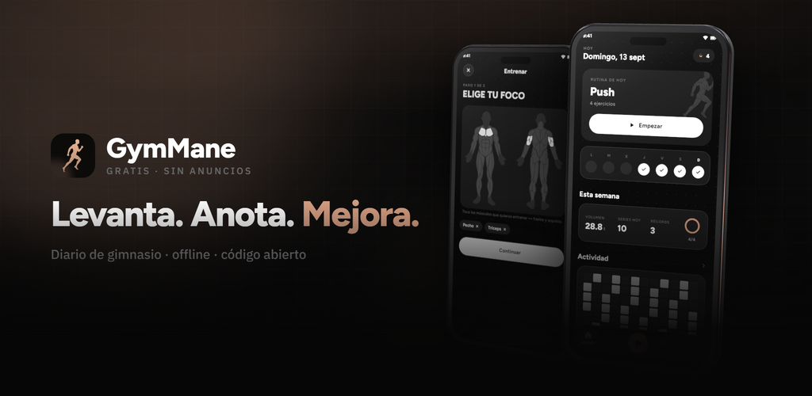

<br/>

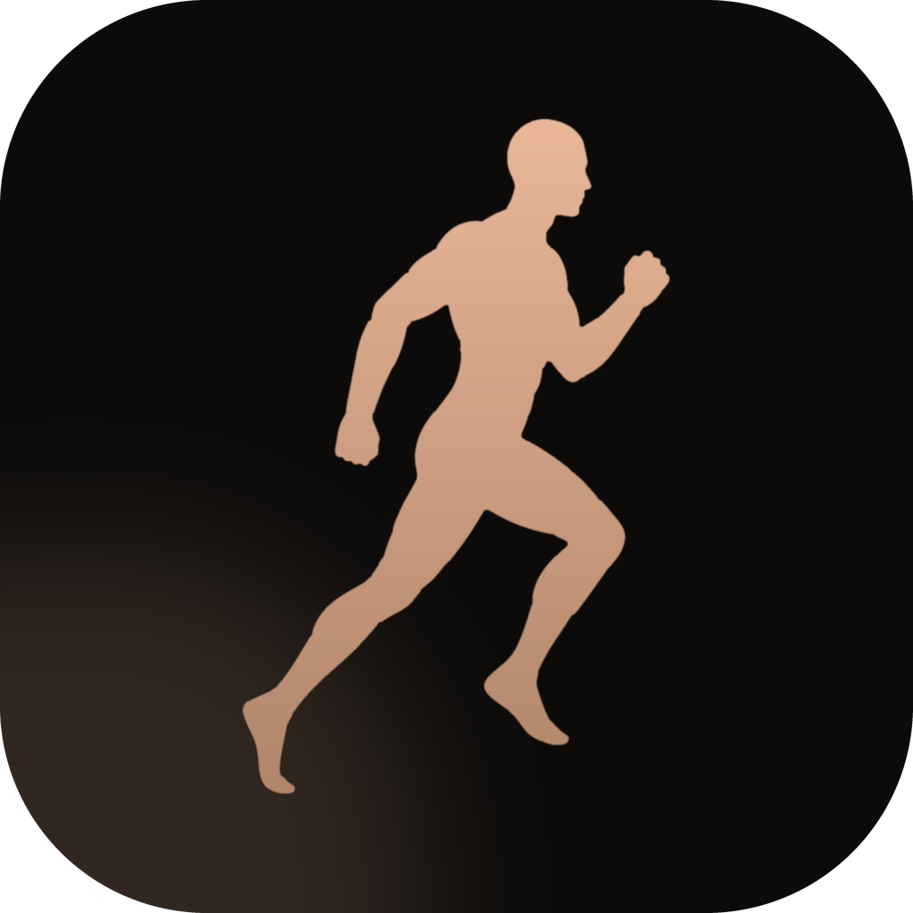

# GymMane

### Un diario de gimnasio oscuro y sin conexión, para Android

Elige los músculos en un mapa del cuerpo de verdad, anota tus series
y mira cómo se mueven tus números.

<br/>

<p>
  
  
  
  
  
  
  <a href="https://github.com/InlitX/GymMane/stargazers"></a>
</p>

<p>
  <a href="https://trendshift.io/repositories/107197?utm_source=trendshift-badge&amp;utm_medium=badge&amp;utm_campaign=badge-trendshift-107197" target="_blank" rel="noopener noreferrer"></a>
</p>

<sub>
  <a href="#-qué-hace">✨ Qué hace</a> ·
  <a href="#-vienes-de-otra-app">📦 Importar</a> ·
  <a href="#-privacidad">🔒 Privacidad</a> ·
  <a href="#-traducciones">🌍 Traducciones</a> ·
  <a href="#-compilar">🛠️ Compilar</a> ·
  <a href="#-apoyo">❤️ Apoyo</a> ·
  <a href="#-licencia-y-créditos">⚖️ Licencia</a>
</sub>

<br/>
<br/>

<sub><a href="README.md">English</a> · <b>Español</b></sub>

</div>

---

<div align="center">


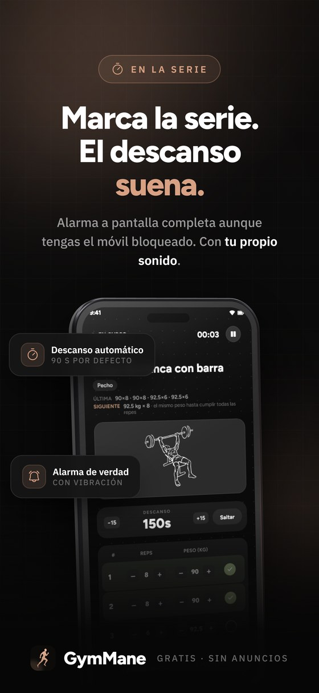


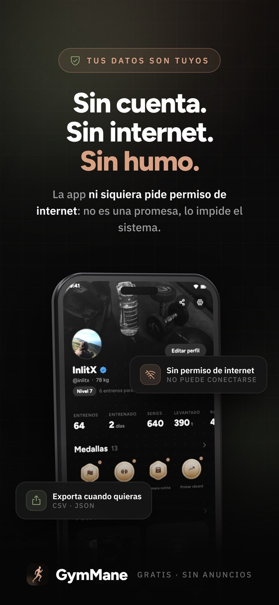

<br/>

<details>
<summary><sub><b>Capturas a pelo</b> — todas las pantallas, directas del móvil</sub></summary>
<br/>

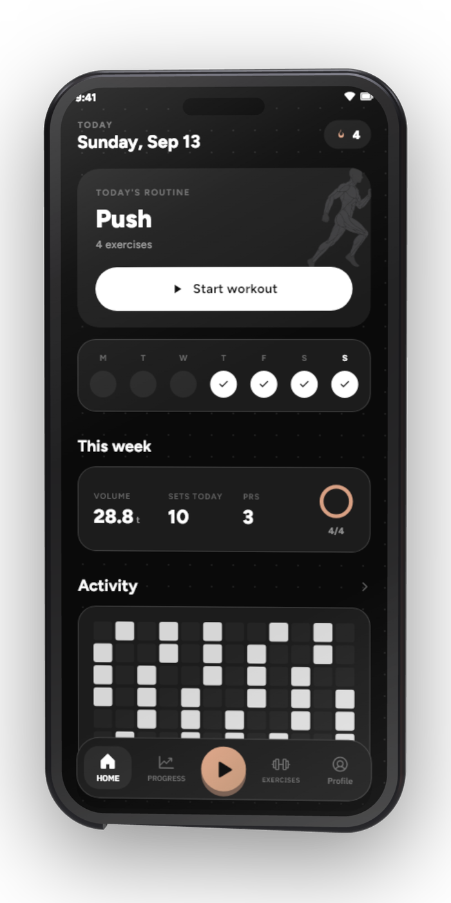
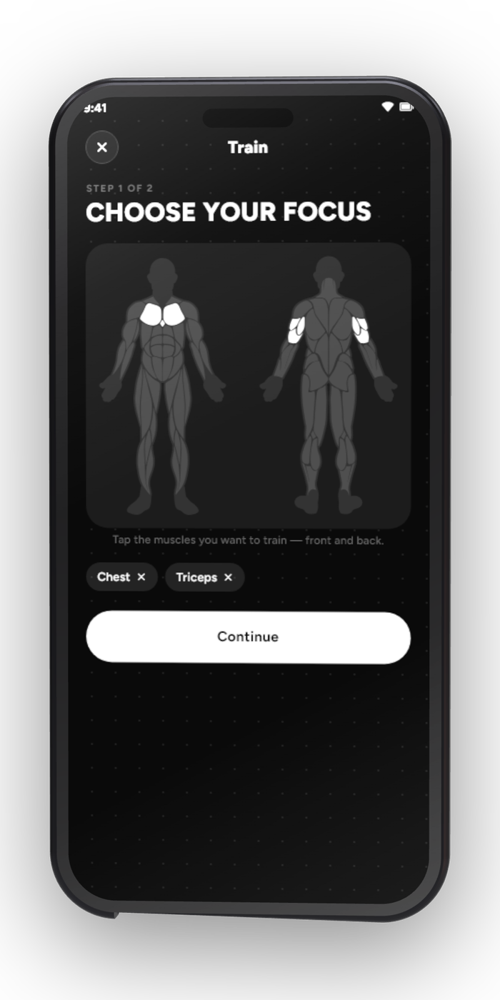
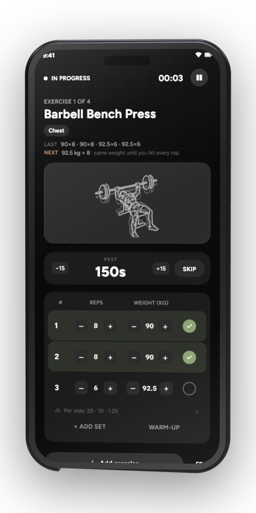
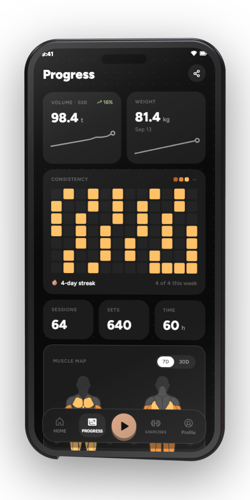

<sub><b>Inicio</b> &nbsp;·&nbsp; <b>Mapa del cuerpo</b> &nbsp;·&nbsp; <b>Sesión en directo</b> &nbsp;·&nbsp; <b>Progreso</b></sub>

<br/>
<br/>

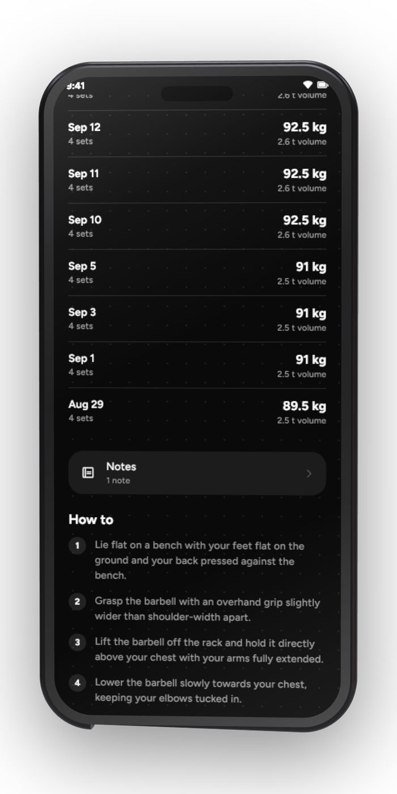
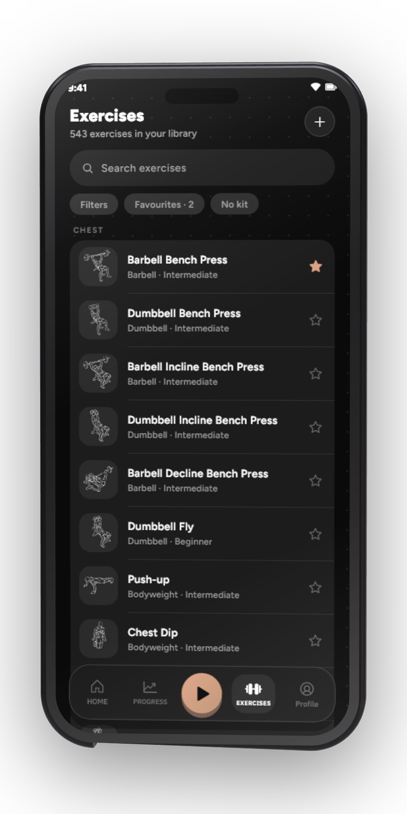
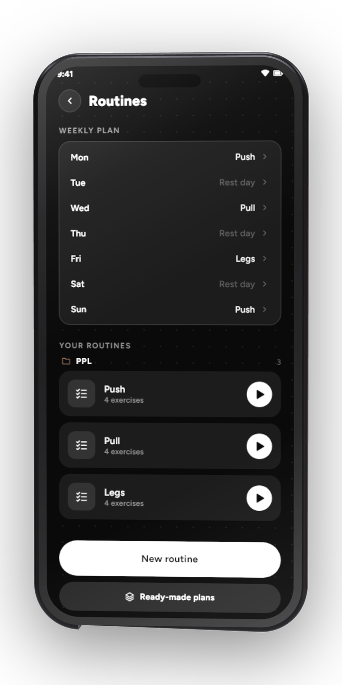
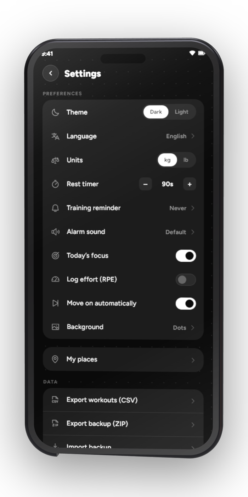

<sub><b>Historial</b> &nbsp;·&nbsp; <b>Biblioteca</b> &nbsp;·&nbsp; <b>Rutinas</b> &nbsp;·&nbsp; <b>Ajustes</b></sub>

</details>

</div>

---

## 👋 Qué es

GymMane es un diario de fuerza de código abierto hecho para el suelo del
gimnasio. Tocas en un cuerpo interactivo los músculos que quieres trabajar,
anotas repeticiones y peso serie a serie, descansas con una alarma que de
verdad se hace oír, y lees un progreso que sale de **tus** propias series:
volumen, récords, racha y reparto muscular. Nada decorativo.

> [!TIP]
> **Tuya del todo.** Sin cuenta, sin anuncios, sin suscripción — y sin ningún
> permiso de internet. Cada serie se queda en tu móvil.

<div align="center">
<br/>
<b>+500</b> ejercicios &nbsp;·&nbsp; <b>6</b> calculadoras &nbsp;·&nbsp; <b>100%</b> offline &nbsp;·&nbsp; <b>0</b> permisos de internet
</div>

---

## ✨ Qué hace

<table>
<tr>
<td width="50%" valign="top">

### 🏋️ Entrenar

- **Mapa del cuerpo interactivo**, frente y espalda — toca lo que quieras entrenar
- Una sesión elegida por ti, y luego editada serie a serie
- Repeticiones, peso y un **cronómetro de descanso** con tu propio sonido de alarma
- La sesión en directo sobrevive a un reinicio — sigues donde lo dejaste
- **Rutinas** que puedes reordenar y asignar a cada día de la semana

</td>
<td width="50%" valign="top">

### 📊 Progreso

- Volumen, racha, anillo de objetivo semanal y **récords**, todo de tus series
- **Mapa de constancia** estilo GitHub, con el detalle de cada día
- **Curvas de fuerza** con 1RM estimado por ejercicio
- Reparto muscular de los últimos 30 días
- Seguimiento del peso corporal con su historial

</td>
</tr>
<tr>
<td width="50%" valign="top">

### 📚 Ejercicios y herramientas

- **+500 ejercicios** con animaciones e instrucciones paso a paso
- Búsqueda, filtros, favoritos y **tus propios ejercicios** (foto, GIF o vídeo)
- **Seis calculadoras** — 1RM, discos, IMC, calorías y macros, grasa corporal, calentamiento
- Dos widgets de pantalla de inicio — actividad y estadísticas

</td>
<td width="50%" valign="top">

### 🔒 Tus datos

- Exporta a **CSV** o a una **copia de seguridad JSON** completa, y vuelve a importarla
- Trae tu historial de **Hevy**, **Strong** o **FitNotes** — entrenos *y* peso corporal
- Borra todo de un toque
- Tema oscuro y claro, kg o lb, español e inglés

</td>
</tr>
</table>

---

## 📦 ¿Vienes de otra app?

Tráete tu historial. GymMane lee los export de entrenos y de medidas de
**Hevy** y **Strong** —el CSV o el zip de medidas— y la copia entera de
**FitNotes**, que es una base de datos SQLite. Cada ejercicio se cruza con su
propia biblioteca y se salta lo que ya tengas anotado.

| App | Qué le das |
|---|---|
| **Hevy** | `workout_data.csv` y el zip de medidas |
| **Strong** | `strong.csv` |
| **FitNotes** | la copia entera `.fitnotes` (SQLite) |

<div align="center"><sub><b>Ajustes → Datos → Importar de otra app</b></sub></div>

---

## 🔒 Privacidad

> [!IMPORTANT]
> GymMane **no tiene analíticas, ni SDK de anuncios, ni código de red**. La app
> ni siquiera pide el permiso `INTERNET` de Android, así que no puede mandar tus
> entrenamientos a ninguna parte. Lo único que sale fuera son los enlaces que
> tocas tú.

Y lo que sí pide, con su porqué:

| Permiso | Para qué |
|---|---|
| `POST_NOTIFICATIONS` | enseñar el descanso y su alarma |
| `USE_EXACT_ALARM` | sonar en el segundo justo, no «cuando toque» |
| `VIBRATE` | que la alarma vibre |
| `WAKE_LOCK` | que suene con la pantalla apagada |

---

## 🌍 Traducciones

Hoy GymMane habla español e inglés, y cualquier otro idioma es más que
bienvenido. Las traducciones viven en [ficheros ARB](lib/l10n) de texto
plano — uno por idioma, sin nada que compilar. Todavía no hay Weblate ni
Crowdin, así que se hace por GitHub: editas el fichero y abres un pull request.

La guía entera está en **TRANSLATING.md**.

---

## 🛠️ Compilar

```bash
git clone https://github.com/InlitX/GymMane.git
cd GymMane
flutter pub get
flutter test
flutter build apk --release
```

---

## 🤝 Contribuir

Los fallos que encuentres, las ideas y los pull requests son bienvenidos — mira
**CONTRIBUTING.md**. Para algo más grande que un arreglo,
abre antes una issue y lo hablamos.

---

## ❤️ Apoyo

<div align="center">

GymMane es gratis, de código abierto y sin anuncios, y así se queda.

Si te ayuda a pisar más el gimnasio, con eso ya me vale. Y si además te apetece
devolver algo, una estrella, una traducción o un informe de fallo bien contado
ayudan tanto como un café.

<a href="https://ko-fi.com/inlitx"></a>

<sub><b>Carteras cripto</b></sub>

<table align="center">
  <tr>
    <td align="center" width="130"><br/><sub><b>Bitcoin</b></sub></td>
    <td><code>bc1qm0r4pg8nknnjh3a7n2t63ckafhsz8jdd6qer29</code></td>
  </tr>
  <tr>
    <td align="center" width="130"><br/><sub><b>Ethereum</b></sub></td>
    <td><code>0x34b7A5552132cBca150Ae29c1E632faA49430e1a</code></td>
  </tr>
  <tr>
    <td align="center" width="130"><br/><sub><b>Solana</b></sub></td>
    <td><code>DC8dNEUNJhWdtBHBZAn4FTheVC3W4PtkGhbazvtk17Jo</code></td>
  </tr>
  <tr>
    <td align="center" width="130"><br/><sub><b>Monero</b></sub></td>
    <td><code>44SECMEf3rfV228kpy3Gs48wLmLXnq231gAMG7ULYoCWBWLYLHdwYV7YFkhMk31DR5P7SRAyRPyhkYaehtgEoajASz7qubq</code></td>
  </tr>
</table>

</div>

---

## ⚖️ Licencia y créditos

| Qué | Licencia |
|---|---|
| La app y su código | [GPL-3.0](LICENSE) |
| Ilustraciones de ejercicios (`assets/art/`) | [CC BY-SA 4.0](https://creativecommons.org/licenses/by-sa/4.0/) |
| Tipografías | SIL Open Font License |

Las ilustraciones vienen de
[Workout Guide](https://github.com/bryllim/workout-guide), de Bryl Lim, que
parte del trabajo de [Everkinetic](https://github.com/everkinetic/data). El
*código* de Workout Guide es MIT, pero su arte es CC BY-SA 4.0 — así que la
copia de GymMane sigue siendo CC BY-SA 4.0, con su crédito. La app las dibuja
como vectores y las tiñe con el tema; los detalles están en **CREDITS.md**.

---

<div align="center">

<a href="https://github.com/InlitX/GymMane"></a>

<br/>
<br/>

Código bajo <b>GNU GPL v3</b>, ilustraciones bajo <b>CC BY-SA 4.0</b>
(Bryl Lim · Everkinetic). Gratis para siempre, y nadie puede cerrarla y revenderla.

</div>
