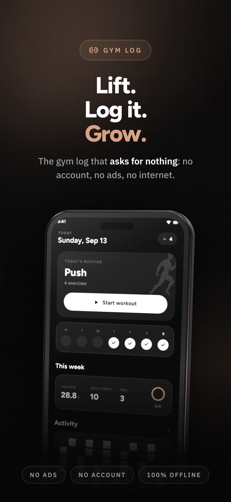
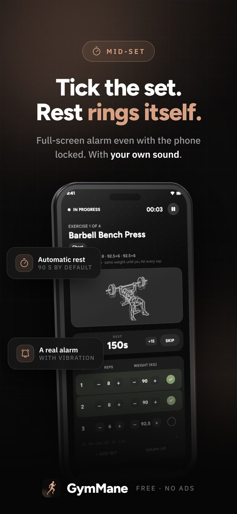
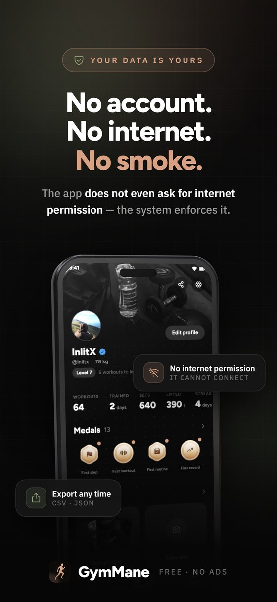

<div align="center">


<br/>


# GymMane

### A dark, offline gym log for Android

Pick your muscles on a real body map, log your sets,
and watch your numbers move.

<br/>

<p>
  
  
  
  
  
  
  <a href="https://github.com/InlitX/GymMane/stargazers"></a>
</p>

<p>
  <a href="https://trendshift.io/repositories/107197?utm_source=trendshift-badge&amp;utm_medium=badge&amp;utm_campaign=badge-trendshift-107197" target="_blank" rel="noopener noreferrer"></a>
</p>

<sub>
  <a href="#-features">✨ Features</a> ·
  <a href="#-coming-from-another-app">📦 Import</a> ·
  <a href="#-privacy">🔒 Privacy</a> ·
  <a href="#-translations">🌍 Translations</a> ·
  <a href="#-building">🛠️ Build</a> ·
  <a href="#-support">❤️ Support</a> ·
  <a href="#-license--credits">⚖️ License</a>
</sub>

<br/>
<br/>

<sub><b>English</b> · <a href="README.es.md">Español</a></sub>

</div>

---

<div align="center">








<br/>

<details>
<summary><sub><b>Plain screenshots</b> — every screen, straight off the phone</sub></summary>
<br/>


<sub><b>Today</b> &nbsp;·&nbsp; <b>Body map</b> &nbsp;·&nbsp; <b>Live session</b> &nbsp;·&nbsp; <b>Progress</b></sub>

<br/>
<br/>


<sub><b>History</b> &nbsp;·&nbsp; <b>Library</b> &nbsp;·&nbsp; <b>Routines</b> &nbsp;·&nbsp; <b>Settings</b></sub>

</details>

</div>

---

## 👋 Overview

GymMane is an open-source strength log built for the gym floor. Tap the muscles
you want to train on an interactive body, log reps and weight set by set, rest
with an alarm that actually gets your attention, and read progress that comes
from **your** own sets — volume, records, streak and muscle split. Nothing
decorative.

> [!TIP]
> **Yours, completely.** No account, no ads, no subscription — and no internet
> permission at all. Every set stays on your phone.

<div align="center">
<br/>
<b>500+</b> exercises &nbsp;·&nbsp; <b>6</b> calculators &nbsp;·&nbsp; <b>100%</b> offline &nbsp;·&nbsp; <b>0</b> internet permissions
</div>

---

## ✨ Features

<table>
<tr>
<td width="50%" valign="top">

### 🏋️ Training

- **Interactive body map**, front and back — tap what you want to train
- A session picked for you, then edited set by set
- Reps, weight and a **rest timer** with your own alarm sound
- A live session survives a reboot — carry on where you left off
- **Routines** you can reorder and schedule per weekday

</td>
<td width="50%" valign="top">

### 📊 Progress

- Volume, streak, weekly goal ring and **PRs**, all from your own sets
- GitHub-style **activity heatmap** with per-day detail
- **Strength curves** with estimated 1RM per exercise
- Muscle split across the last 30 days
- Bodyweight tracking with history

</td>
</tr>
<tr>
<td width="50%" valign="top">

### 📚 Exercises & tools

- **500+ exercises** with animations and step-by-step instructions
- Search, filters, favourites and **your own exercises** (photo, GIF or video)
- **Six calculators** — 1RM, plates, BMI, calories & macros, body fat, warm-up
- Two home-screen widgets — activity and stats

</td>
<td width="50%" valign="top">

### 🔒 Your data

- Export to **CSV** or a full **JSON backup**, and import it back
- Import your history from **Hevy**, **Strong** or **FitNotes** — workouts *and* bodyweight
- Delete everything in one tap
- Dark and light themes, kg or lb, English and Spanish

</td>
</tr>
</table>

---

## 📦 Coming from another app?

Bring your history with you. GymMane reads the workout and measurement exports
of **Hevy** and **Strong** — CSV or the measurements zip — and the whole
**FitNotes** backup, which is a SQLite database. Every exercise is matched
against its own library and anything you already logged is skipped.

| App | What to hand it |
|---|---|
| **Hevy** | `workout_data.csv`, plus the measurements zip |
| **Strong** | `strong.csv` |
| **FitNotes** | the whole `.fitnotes` backup (SQLite) |

<div align="center"><sub><b>Settings → Data → Import from another app</b></sub></div>

---

## 🔒 Privacy

> [!IMPORTANT]
> GymMane has **no analytics, no ad SDK and no network code**. The app never
> asks for Android's `INTERNET` permission, so it cannot send your training
> anywhere. The only outbound actions are links you tap yourself.

Everything it *does* ask for, and why:

| Permission | What it is for |
|---|---|
| `POST_NOTIFICATIONS` | show the rest timer and its alarm |
| `USE_EXACT_ALARM` | ring at the right second, not "sometime later" |
| `VIBRATE` | the alarm buzzes |
| `WAKE_LOCK` | the alarm fires with the screen off |

---

## 🌍 Translations

GymMane speaks English and Spanish today, and more languages are very welcome.
Translations live in plain [ARB files](lib/l10n) — one file per
language, nothing to compile. There is no Weblate or Crowdin yet, so it goes
through GitHub: edit the file and open a pull request.

The full guide lives in **TRANSLATING.md**.

---

## 🛠️ Building

```bash
git clone https://github.com/InlitX/GymMane.git
cd GymMane
flutter pub get
flutter test
flutter build apk --release
```

---

## 🤝 Contributing

Bug reports, ideas and pull requests are all welcome — see
**CONTRIBUTING.md**. For anything larger than a fix, open an
issue first so we can agree on the direction.

---

## ❤️ Support

<div align="center">

GymMane is free, open source and free of ads, and it stays that way.

If it helps you show up at the gym more often, that is already enough. If you
also feel like giving something back, a star, a translation or a clear bug
report help as much as a coffee does.

<a href="https://ko-fi.com/inlitx"></a>

<sub><b>Crypto wallets</b></sub>

<table align="center">
  <tr>
    <td align="center" width="130"><br/><sub><b>Bitcoin</b></sub></td>
    <td><code>bc1qm0r4pg8nknnjh3a7n2t63ckafhsz8jdd6qer29</code></td>
  </tr>
  <tr>
    <td align="center" width="130"><br/><sub><b>Ethereum</b></sub></td>
    <td><code>0x34b7A5552132cBca150Ae29c1E632faA49430e1a</code></td>
  </tr>
  <tr>
    <td align="center" width="130"><br/><sub><b>Solana</b></sub></td>
    <td><code>DC8dNEUNJhWdtBHBZAn4FTheVC3W4PtkGhbazvtk17Jo</code></td>
  </tr>
  <tr>
    <td align="center" width="130"><br/><sub><b>Monero</b></sub></td>
    <td><code>44SECMEf3rfV228kpy3Gs48wLmLXnq231gAMG7ULYoCWBWLYLHdwYV7YFkhMk31DR5P7SRAyRPyhkYaehtgEoajASz7qubq</code></td>
  </tr>
</table>

</div>

---

## ⚖️ License & credits

| What | License |
|---|---|
| The app and its code | [GPL-3.0](LICENSE) |
| Exercise illustrations (`assets/art/`) | [CC BY-SA 4.0](https://creativecommons.org/licenses/by-sa/4.0/) |
| Fonts | SIL Open Font License |

The exercise illustrations come from
[Workout Guide](https://github.com/bryllim/workout-guide) by Bryl Lim, built on
pose artwork from [Everkinetic](https://github.com/everkinetic/data). Workout
Guide's *code* is MIT, but its artwork is CC BY-SA 4.0 — so GymMane's copy stays
CC BY-SA 4.0 too, credit included. GymMane draws it as vectors and tints it with
the theme; **CREDITS.md** has the details.

---

<div align="center">

<a href="https://github.com/InlitX/GymMane"></a>

<br/>
<br/>

Code released under the <b>GNU GPL v3</b>, exercise art under <b>CC BY-SA 4.0</b>
(Bryl Lim · Everkinetic). Free forever, and nobody can close it up and resell it.

</div>
